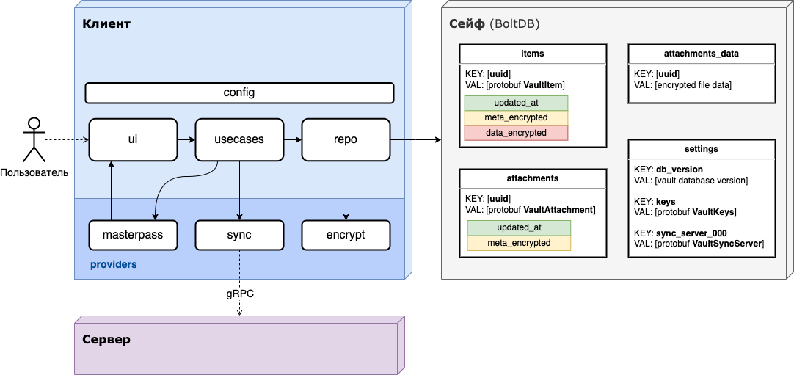
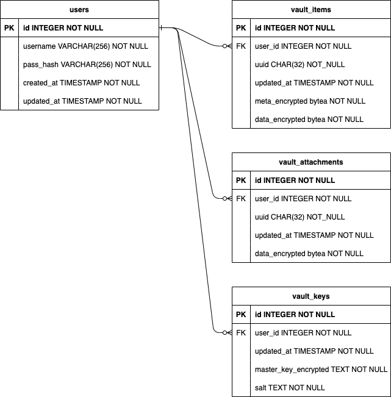
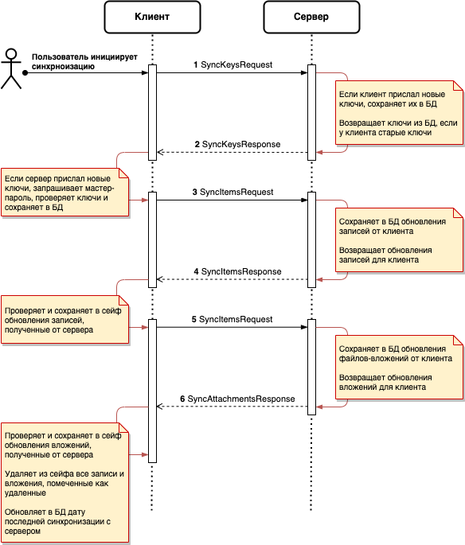

# Менеджер паролей Gophkeeper

Дизайн решения для безопасного хранения паролей, данных банковских карт,
ключей API, файлов сертификатов и другой чувствительной информации. 

Решение состоит из клиентского TUI-приложения, локального хранилища данных (сейфа) 
и сервера для синхронизации записей сейфа между несколькими клиентами одного пользователя.

## Основные возможности решения
- авторизация доступа пользователя к сейфу
- шифрование данных сейфа
- создание, отображение, поиск, редактирование, удаление записей в сейфе
- встроенные шаблоны для наиболее часто используемых типов записей
- синхронизация данных пользователя через удаленный сервер с использованием end-to-end шифрования
- работа offline
- работа в разных средах (Windows, Linux, macOS)

## Клиент
Клиент представляет собой TUI-приложение и поставляется в виде 
одного бинарного файла для разных платформ (Windows, Linux, macOS).

Клиент реализует 
- авторизацию доступа пользователя к сейфу
- шифрование и расшифровку данных сейфа
- работу пользователя с записями сейфа
- синхронизацию записей сейфа с удаленным сервером

### Архитектура клиента

## Сейф
Локальный сейф реализован в виде KV-хранилища BoltDB. 
Все чувствительные данные хранятся в сейфе в зашифрованном виде. 

### Шифрование данных сейфа
Все чувствительные данные в сейфе шифруются **мастер-ключом сейфа**,
который в свою очередь шифруется **мастер-паролем сейфа**.

Таким образом файл сейфа может безопасно храниться на диске 
и передаваться по не защищенным каналам связи.

Для шифрования данных сейфа и мастер-ключа используется симметричный 
алгоритм с авторизацией (AES-256-GCM).

#### Мастер-ключ сейфа
- используется для шифрования и расшифровки данных сейфа
- генерируется случайным образом при создании сейфа
- не изменяется после создания сейфа
- хранится в оперативной памяти приложения с использованием механизмов защиты от дампинга памяти (memguard) и свопа памяти на диск (mlock)
- хранится в сейфе и на удаленном сервере в зашифрованном виде
- при открытии сейфа мастер-ключ расшифровывается с помощью **мастер-пароля сейфа**

#### Мастер-пароль сейфа
- используется для шифрования и расшифровки мастер-ключа сейфа
- задается пользователем при создании сейфа
- вводится пользователем при открытии сейфа
- может быть изменен пользователем
- не хранится в сейфе
- не передается на сервер
- не хранится в оперативной памяти дольше времени, необходимого для расшифровки мастер-ключа сейфа
- после ввода и использования уничтожается из оперативной памяти (см. Безопасность операций терминального ввода-вывода)

## Сервер

Сервер реализует синхронизацию записей сейфа между клиентами одного пользователя.
Может быть запущен на ОС Linux или в Docker-контейнере.

Сервер взаимодействует с клиентом по протоколу gRPC.
В качестве хранилища данных сервера используется БД PostgreSQL.

### Основные возможности сервера
- регистрация нового пользователя по логину и паролю
- авторизация и аутентификация пользователя
- хранение записей сейфа пользователя
- синхронизация записей сейфа между разными клиентами одного пользователя

### Схема базы данных сервера

### Безопасность сервера
Все чувствительные данные, включая мастер-ключ сейфа и метаданные для синхронизации,
передаются на сервер зашифрованном виде. На стороне сервера отсутствует возможность расшифровки
данных. 

Таким образом, если злоумышленник получит полный доступ к серверу,
он не сможет получить доступ к данным пользователей, а также не сможет
совершать деструктивные действия при синхронизации клиентов.

## Взаимодействие клиента и сервера
Клиент и сервер взаимодействуют по протоколу gRPC.

### Аутентификация, авторизация и работа с учетной записью

Аутентификация выполняется по логину и паролю пользователя либо по `refresh_token`. 
В случае успешной аутентификации сервер возвращает `access_token` и `refresh_token`.

Далее клиент использует `access_token` в заголовке запроса для авторизации доступа к ресурсам сервера.

В качестве `access_token` и `refresh_token` используются JWT-токены.

Для работы с учетной записью пользователя на сервере доступны следующие методы:
- регистрация нового пользователя по логину и паролю
- изменение логина пользователя
- изменение пароля пользователя
- удаление учетной записи пользователя

### Синхронизация

Запрос на синхронизацию записей сейфа инициируется клиентом. 
В запросе передается дата последней синхронизации, 
а также список записей сейфа, которые были изменены с момента последней синхронизации.

Сервер в ответ возвращает список записей сейфа, 
которые были изменены на сервере с указанной в запросе
даты последней синхронизации.

### Безопасность синхронизации
Сервер получает от клиента записи сейфа в зашифрованном виде, 
не имеет возможности расшифровать их и поэтому считает 
по-умолчанию достоверными.

Клиент считает записи полученные от сервера недостоверными и
дополнительно проверяет их целостность, используя механизм 
авторизации шифрования (GCM).

Таким образом, если один из клиентов пользователя окажется скомпрометирован
(например, произойдет утечка логина-пароля или токенов доступа к серверу),
то злоумышленник (при условии, что ему не известен мастер-пароль сейфа) в самом худшем случае сможет 
нарушить целостность данных пользователя на стороне сервера. При этом локальные данные не скомпрометированных клиентов
останутся целостными, тк клиенты не примут недостоверные данные от сервера.

## Дальнейшее развитие решения
С силу ограничений по времени, некоторые функции и аспекты безопасности 
не вошли в решение, но могут быть реализованы в дальнейшем.

### Безопасность операций терминального ввода-вывода
Существующие TUI-библиотеки не обеспечивают должный уровень безопасной работы с
памятью при рендеринге в консоль и вводе с клавиатуры. Таким образом клиентское приложение
потенциально уязвимо, если злоумышленник может выполнить дампинг памяти,
либо получит доступ к свопу памяти на диск или вводу с клавиатуры.

Для решения данных проблем необходимо создать специализированную TUI-библиотеку,
либо существенно доработать одну из существующих библиотек.

### Поддержка множества сейфов
В текущей реализации клиентское приложение поддерживает только один сейф.
Архитектура решения позволяет в будущем реализовать поддержку множества сейфов.

### Слияние сейфов
Если пользователь создаст один сейф на локальном компьютере,
а затем создаст другой сейф на другом компьютере, 
то невозможно будет синхронизировать записи этих сейфов через
удаленный сервер, так как сейфы будут иметь разные мастер-ключи.

Для решения этой проблемы возможно реализовать механизм слияния сейфов.

### Ограничение объема хранимых данных
В текущей реализации сервер не ограничивает объем хранимых данных пользователя.
Это может привести к ситуации, когда злоумышленник может забить сервер
ненужными записями.

В будущем необходимо реализовать механизм ограничения объема хранимых данных.

---

© 2023 Oleg Fomin, [ofstudio@gmail.com](mailto:ofstudio@gmail.com)
